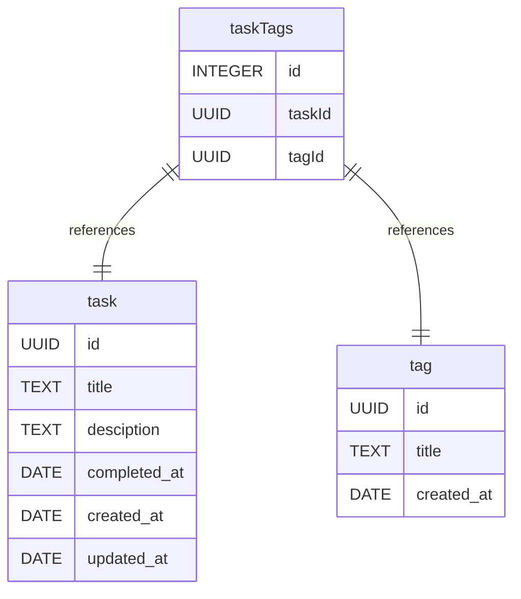
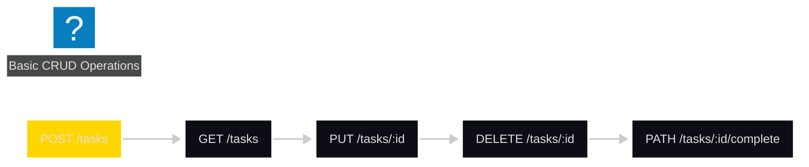

# Yet Another Task API

- This is a pure NodeJS API for managing tasks
- You can find the challenge [here](https://efficient-sloth-d85.notion.site/Desafio-01-2d48608f47644519a408b438b52d913f).
- I've also created a Postman collection to test the API. You can find it [here](https://www.postman.com/planetary-capsule-555446/workspace/yata/collection/33747709-740ab1ac-8df2-44d7-aa52-87edb04b3d1c?action=share&creator=33747709).

## Database Diagram

In this project a JSON file is used as a database for the storage of tasks and tags. I've used [drawdb](https://www.drawdb.app/) to draw a relational database diagram in which the project is based of.

## Table structure

### task

| Name        | Type          | Settings                      |
|-------------|---------------|-------------------------------|
| **id** | UUID | 🔑 PK, not null, unique |
| **title** | TEXT | not null |
| **desciption** | TEXT | null |
| **completed_at** | DATE | null |
| **created_at** | DATE | not null |
| **updated_at** | DATE | null |

### tag

| Name        | Type          | Settings                      |
|-------------|---------------|-------------------------------|
| **id** | UUID | 🔑 PK, not null, unique |
| **title** | TEXT | null |
| **created_at** | DATE | not null |

### taskTags
Task - Tags linking table
| Name        | Type          | Settings                      | References                    |
|-------------|---------------|-------------------------------|-------------------------------|
| **id** | INTEGER | 🔑 PK, not null, unique, autoincrement |   |
| **taskId** | UUID | not null | fk_taskTags_taskId_task |
| **tagId** | UUID | not null | fk_taskTags_tagId_tag |

## Relationships

- **taskTags to task**: one_to_one
- **taskTags to tag**: one_to_one

## Database Diagram

### Roadmap

## Author
> Created by [Gabriel Witor](https://github.com/gabrielwitor), 2025 August.